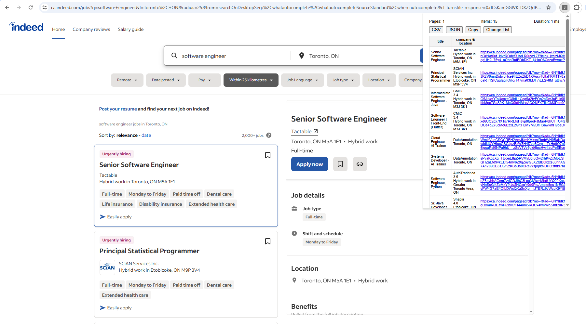
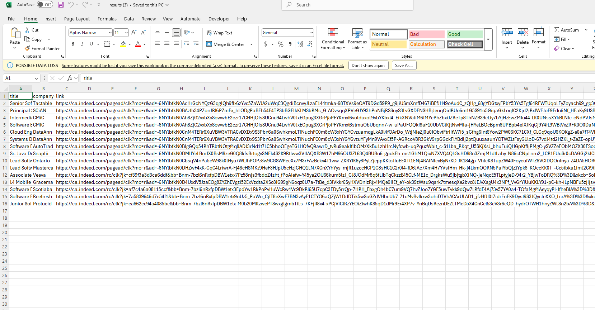

# Job Scraper

**Job Scraper** is a Chrome Extension (Manifest V3) that lets non-coders scrape any website with a single click. Everything runs locally—no backend servers or external APIs.

---

## Demo

### Indeed Results

### CSV

---

## Features

- **One-click scrape** via toolbar icon  
- **Default presets** for Gmail, LinkedIn, & Indeed  
- **Pages / Items / Duration** displayed in popup  
- **Export** as CSV, JSON, or Copy to clipboard  
- **Customizable** selectors via a settings pane  
- **Optional** “Load more” click-through for infinite scroll  
- 100% client-side—your data never leaves your browser

---

## Installation

1. Clone or download this repo.  
2. In Chrome go to `chrome://extensions/`.  
3. Enable **Developer mode** (toggle top-right).  
4. Click **Load unpacked** and select this extension’s folder.  
5. The **Job Scraper** icon appears next to the address bar.

---

## Usage

1. Navigate to your page of interest (Gmail inbox, LinkedIn Jobs search, Indeed listings).  
2. Click the **Job Scraper** toolbar icon.  
3. Popup displays:  
   - **Pages** (currently always 1)  
   - **Items** scraped  
   - **Duration** in ms  
4. If results exist, a table appears with three columns:  
   - **title**  
   - **company & location**  
   - **link**  
5. Use **CSV**, **JSON**, or **Copy** buttons to export.  
6. To customize:  
   - Click **Change List**  
   - Edit **List Selector** (CSS for item containers)  
   - (Optionally) **Load More Selector** (CSS of “Load more” button)  
   - Edit **Detail Selectors** (JSON array of `{ "name": "...", "selector": "..." }`)  
   - Click **Save**

---

